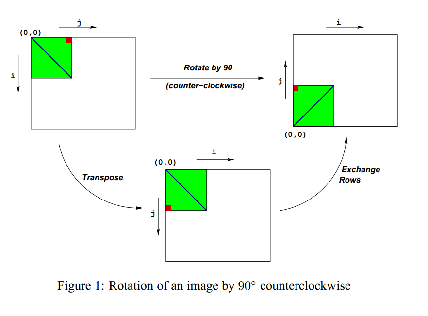
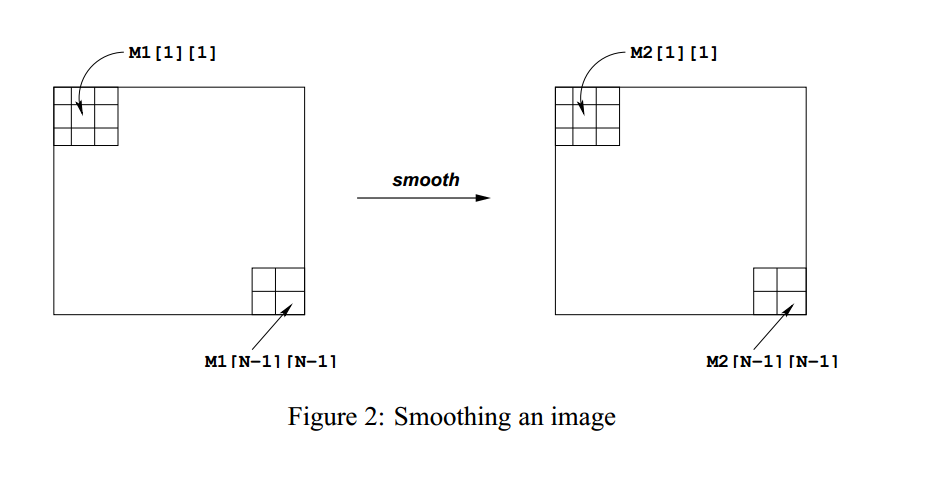

接下来两个lab都是和程序优化有关，内容基于CSAPP的*第五章：优化程序性能*和第六章*存储器层次结构*

Performance Lab其实是本书第二版中这一章节的实验，在第三版中它已经被Cache Lab取代，不过作为Cache Lab的一个预热，也是值得做一做的。当然这个Lab比较简单，我就不做过多说明了。

## Performance Lab 简介

这个实验要求你优化两个图像处理函数，分别是`rotate`（把图像逆时针旋转90°），`smooth`（使图像变平滑）。讲义上给出的算法如下：






简单的说，就是旋转操作先进行一个转置，进行对行的上下颠倒。平滑操作要把每一个位置的值变成它周围一圈的值的平均值。

## 文件说明

我们要修改的程序只有`kernel.c`这一个，首先在开头填写上自己的名字。

文件里的`naive_rotate`和`naive_smooth`就是没有优化过的很慢的版本，而`register_rotate_functions`和`register_smooth_functions`这两个函数可以让你来添加测试样例，格式参考两个`naive`的函数。我们要做的，就是在下面添加上我们优化过的函数。

## Part A：

这部分比较简单，要求我们实现一个图像的旋转，其实也就是矩阵的旋转，给定的算法是先转置再行颠倒，实际上这两步是同时进行的。在文件中设计了一个`RIDX`宏，用来定位(i,j)位置的元素。

这里直我们直接简单的分块就好，整个过程没有什么特例，分块之后可以减少大量的cache miss，从而提升速度。

由于不知道具体的Cache大小如何，我在这里尝试了4 * 4， 8 * 8， 46 * 46， 32 * 32四种分块。

```c
char rotate_descr1[] = "rotate: 4*4 version";
void rotate(int dim, pixel *src, pixel *dst) 
{
    int i, j, k, l;
    int div = 8;
    for (i = 0; i < dim; i += div) {
        for (j = 0; j < dim; j += div) {
            for (k = i; k < i + div; k++) {
                for (l = j; l < j + div; l++) {
                    dst[RIDX(k, l, dim)] = src[RIDX(l, dim - 1 - k, dim)];
                }
            }
        }
    }
}

char rotate_descr2[] = "rotate: 8*8 version";
void rotate2(int dim, pixel *src, pixel *dst) 
{
    int i, j, k, l;
    int div = 16;
    for (i = 0; i < dim; i += div) {
        for (j = 0; j < dim; j += div) {
            for (k = i; k < i + div; k++) {
                for (l = j; l < j + div; l++) {
                    dst[RIDX(k, l, dim)] = src[RIDX(l, dim - 1 - k, dim)];
                }
            }
        }
    }
}

char rotate_descr3[] = "rotate: 16*16 version";
void rotate3(int dim, pixel *src, pixel *dst) 
{
    int i, j, k, l;
    int div = 16;
    for (i = 0; i < dim; i += div) {
        for (j = 0; j < dim; j += div) {
            for (k = i; k < i + div; k++) {
                for (l = j; l < j + div; l++) {
                    dst[RIDX(k, l, dim)] = src[RIDX(l, dim - 1 - k, dim)];
                }
            }
        }
    }
}

char rotate_descr4[] = "rotate: 32*32 version";
void rotate4(int dim, pixel *src, pixel *dst) 
{
    int i, j, k, l;
    int div = 32;
    for (i = 0; i < dim; i += div) {
        for (j = 0; j < dim; j += div) {
            for (k = i; k < i + div; k++) {
                for (l = j; l < j + div; l++) {
                    dst[RIDX(k, l, dim)] = src[RIDX(l, dim - 1 - k, dim)];
                }
            }
        }
    }
}
```

具体的测试结果见最后。

## Part B：

第二部分要求我们实现一个平滑操作，讲每个数用它周围一圈的数的平均数代替。

这里要注意的就是要分情况了，直接的一起循环并判断条件会造成超大量的分支预测，这里面会造成极大的时间浪费。

首先四个角和四条边上的显然和中间的不同，我们把这几种情况单独拆开处理。

然后对于中间的部分，我们把内部的情况展开，同时直接写出对应结果的计算公式，既减少了过程调用，同事也因为没有判断而减少了大量的分支预测。

最终我优化的代码如下：

```c
char smooth_descr[] = "smooth: Current working version";
void smooth(int dim, pixel *src, pixel *dst) 
{
    int i, j;

    for (i = 1; i < dim - 1; i++) {
        for (j = 1; j < dim - 1; j++) {
            dst[RIDX(i, j, dim)].red = (src[RIDX(i - 1, j - 1, dim)].red + src[RIDX(i, j - 1, dim)].red + src[RIDX(i + 1, j - 1, dim)].red +
                                        src[RIDX(i - 1, j, dim)].red + src[RIDX(i, j, dim)].red + src[RIDX(i + 1, j, dim)].red +
                                        src[RIDX(i - 1, j + 1, dim)].red + src[RIDX(i, j + 1, dim)].red + src[RIDX(i + 1, j + 1, dim)].red) / 9;
            dst[RIDX(i, j, dim)].green = (src[RIDX(i - 1, j - 1, dim)].green + src[RIDX(i, j - 1, dim)].green + src[RIDX(i + 1, j - 1, dim)].green +
                                          src[RIDX(i - 1, j, dim)].green + src[RIDX(i, j, dim)].green + src[RIDX(i + 1, j, dim)].green +
                                          src[RIDX(i - 1, j + 1, dim)].green + src[RIDX(i, j + 1, dim)].green + src[RIDX(i + 1, j + 1, dim)].green) / 9;
            dst[RIDX(i, j, dim)].blue = (src[RIDX(i - 1, j - 1, dim)].blue + src[RIDX(i, j - 1, dim)].blue + src[RIDX(i + 1, j - 1, dim)].blue +
                                         src[RIDX(i - 1, j, dim)].blue + src[RIDX(i, j, dim)].blue + src[RIDX(i + 1, j, dim)].blue +
                                         src[RIDX(i - 1, j + 1, dim)].blue + src[RIDX(i, j + 1, dim)].blue + src[RIDX(i + 1, j + 1, dim)].blue) / 9;
        }
    }
    for (i = 1; i < dim - 1; i++) {
        dst[RIDX(i, 0, dim)].red = (src[RIDX(i - 1, 0, dim)].red + src[RIDX(i, 0, dim)].red + src[RIDX(i + 1, 0, dim)].red +
                                    src[RIDX(i - 1, 1, dim)].red + src[RIDX(i, 1, dim)].red + src[RIDX(i + 1, 1, dim)].red) / 6;
        dst[RIDX(i, 0, dim)].green = (src[RIDX(i - 1, 0, dim)].green + src[RIDX(i, 0, dim)].green + src[RIDX(i + 1, 0, dim)].green +
                                      src[RIDX(i - 1, 1, dim)].green + src[RIDX(i, 1, dim)].green + src[RIDX(i + 1, 1, dim)].green) / 6;
        dst[RIDX(i, 0, dim)].blue = (src[RIDX(i - 1, 0, dim)].blue + src[RIDX(i, 0, dim)].blue + src[RIDX(i + 1, 0, dim)].blue +
                                     src[RIDX(i - 1, 1, dim)].blue + src[RIDX(i, 1, dim)].blue + src[RIDX(i + 1, 1, dim)].blue) / 6;
    }
    for (i = 1; i < dim - 1; i++) {
        dst[RIDX(i, dim - 1, dim)].red = (src[RIDX(i - 1, dim - 2, dim)].red + src[RIDX(i, dim - 2, dim)].red + src[RIDX(i + 1, dim - 2, dim)].red +
                                          src[RIDX(i - 1, dim - 1, dim)].red + src[RIDX(i, dim - 1, dim)].red + src[RIDX(i + 1, dim - 1, dim)].red) / 6;
        dst[RIDX(i, dim - 1, dim)].green = (src[RIDX(i - 1, dim - 2, dim)].green + src[RIDX(i, dim - 2, dim)].green + src[RIDX(i + 1, dim - 2, dim)].green +
                                            src[RIDX(i - 1, dim - 1, dim)].green + src[RIDX(i, dim - 1, dim)].green + src[RIDX(i + 1, dim - 1, dim)].green) / 6;
        dst[RIDX(i, dim - 1, dim)].blue = (src[RIDX(i - 1, dim - 2, dim)].blue + src[RIDX(i, dim - 2, dim)].blue + src[RIDX(i + 1, dim - 2, dim)].blue +
                                           src[RIDX(i - 1, dim - 1, dim)].blue + src[RIDX(i, dim - 1, dim)].blue + src[RIDX(i + 1, dim - 1, dim)].blue) / 6;
    }
    for (j = 1; j < dim - 1; j++) {
        dst[RIDX(0, j, dim)].red = (src[RIDX(0, j - 1, dim)].red + src[RIDX(0, j, dim)].red + src[RIDX(0, j + 1, dim)].red +
                                    src[RIDX(1, j - 1, dim)].red + src[RIDX(1, j, dim)].red + src[RIDX(1, j + 1, dim)].red) / 6;
        dst[RIDX(0, j, dim)].green = (src[RIDX(0, j - 1, dim)].green + src[RIDX(0, j, dim)].green + src[RIDX(0, j + 1, dim)].green +
                                      src[RIDX(1, j - 1, dim)].green + src[RIDX(1, j, dim)].green + src[RIDX(1, j + 1, dim)].green) / 6;
        dst[RIDX(0, j, dim)].blue = (src[RIDX(0, j - 1, dim)].blue + src[RIDX(0, j, dim)].blue + src[RIDX(0, j + 1, dim)].blue +
                                     src[RIDX(1, j - 1, dim)].blue + src[RIDX(1, j, dim)].blue + src[RIDX(1, j + 1, dim)].blue) / 6;
    }
    for (j = 1; j < dim - 1; j++) {
        dst[RIDX(dim - 1, j, dim)].red = (src[RIDX(dim - 1, j - 1, dim)].red + src[RIDX(dim - 1, j, dim)].red + src[RIDX(dim - 1, j + 1, dim)].red +
                                          src[RIDX(dim - 2, j - 1, dim)].red + src[RIDX(dim - 2, j, dim)].red + src[RIDX(dim - 2, j + 1, dim)].red) / 6;
        dst[RIDX(dim - 1, j, dim)].green = (src[RIDX(dim - 1, j - 1, dim)].green + src[RIDX(dim - 1, j, dim)].green + src[RIDX(dim - 1, j + 1, dim)].green +
                                            src[RIDX(dim - 2, j - 1, dim)].green + src[RIDX(dim - 2, j, dim)].green + src[RIDX(dim - 2, j + 1, dim)].green) / 6;
        dst[RIDX(dim - 1, j, dim)].blue = (src[RIDX(dim - 1, j - 1, dim)].blue + src[RIDX(dim - 1, j, dim)].blue + src[RIDX(dim - 1, j + 1, dim)].blue +
                                           src[RIDX(dim - 2, j - 1, dim)].blue + src[RIDX(dim - 2, j, dim)].blue + src[RIDX(dim - 2, j + 1, dim)].blue) / 6;
    }

    dst[RIDX(0, 0, dim)].red = 
    (src[RIDX(0, 0, dim)].red + src[RIDX(0, 1, dim)].red + src[RIDX(1, 0, dim)].red +src[RIDX(1, 1, dim)].red) >> 2;
    dst[RIDX(0, 0, dim)].green = 
    (src[RIDX(0, 0, dim)].green + src[RIDX(0, 1, dim)].green + src[RIDX(1, 0, dim)].green +src[RIDX(1, 1, dim)].green) >> 2;
    dst[RIDX(0, 0, dim)].blue = 
    (src[RIDX(0, 0, dim)].blue + src[RIDX(0, 1, dim)].blue + src[RIDX(1, 0, dim)].blue +src[RIDX(1, 1, dim)].blue) >> 2;

    dst[RIDX(0, dim - 1, dim)].red = 
    (src[RIDX(0, dim - 1, dim)].red + src[RIDX(0, dim - 2, dim)].red + src[RIDX(1, dim - 1, dim)].red +src[RIDX(1, dim - 2, dim)].red) >> 2;
    dst[RIDX(0, dim - 1, dim)].green = 
    (src[RIDX(0, dim - 1, dim)].green + src[RIDX(0, dim - 2, dim)].green + src[RIDX(1, dim - 1, dim)].green +src[RIDX(1, dim - 2, dim)].green) >> 2;
    dst[RIDX(0, dim - 1, dim)].blue = 
    (src[RIDX(0, dim - 1, dim)].blue + src[RIDX(0, dim - 2, dim)].blue + src[RIDX(1, dim - 1, dim)].blue +src[RIDX(1, dim - 2, dim)].blue) >> 2;

    dst[RIDX(dim - 1, 0, dim)].red = 
    (src[RIDX(dim - 1, 0, dim)].red + src[RIDX(dim - 1, 1, dim)].red + src[RIDX(dim - 2, 0, dim)].red +src[RIDX(dim - 2, 1, dim)].red) >> 2;
    dst[RIDX(dim - 1, 0, dim)].green = 
    (src[RIDX(dim - 1, 0, dim)].green + src[RIDX(dim - 1, 1, dim)].green + src[RIDX(dim - 2, 0, dim)].green +src[RIDX(dim - 2, 1, dim)].green) >> 2;
    dst[RIDX(dim - 1, 0, dim)].blue = 
    (src[RIDX(dim - 1, 0, dim)].blue + src[RIDX(dim - 1, 1, dim)].blue + src[RIDX(dim - 2, 0, dim)].blue +src[RIDX(dim - 2, 1, dim)].blue) >> 2;

    dst[RIDX(dim - 1, dim - 1, dim)].red = 
    (src[RIDX(dim - 1, dim - 1, dim)].red + src[RIDX(dim - 2, dim - 1, dim)].red + src[RIDX(dim - 1, dim - 2, dim)].red +src[RIDX(dim - 2, dim - 2, dim)].red) >> 2;
    dst[RIDX(dim - 1, dim - 1, dim)].green = 
    (src[RIDX(dim - 1, dim - 1, dim)].green + src[RIDX(dim - 2, dim - 1, dim)].green + src[RIDX(dim - 1, dim - 2, dim)].green +src[RIDX(dim - 2, dim - 2, dim)].green) >> 2;
    dst[RIDX(dim - 1, dim - 1, dim)].blue = 
    (src[RIDX(dim - 1, dim - 1, dim)].blue + src[RIDX(dim - 2, dim - 1, dim)].blue + src[RIDX(dim - 1, dim - 2, dim)].blue +src[RIDX(dim - 2, dim - 2, dim)].blue) >> 2;
}
```

## 总结

这个Lab还算是挺简单的，基本就是把书上将的东西简单的实现一下。比较有趣的是下一次的Cache Lab。

下面是我的优化的测试结果：

```
Teamname: Saltedfish
Member 1: Yue Pan
Email 1: zxc479773533@gmail.com

Rotate: Version = naive_rotate: Naive baseline implementation:
Dim		64	128	256	512	1024	Mean
Your CPEs	2.1	3.1	6.1	10.9	10.6
Baseline CPEs	14.7	40.1	46.4	65.9	94.5
Speedup		6.9	12.9	7.5	6.0	8.9	8.2

Rotate: Version = rotate: 4*4 version:
Dim		64	128	256	512	1024	Mean
Your CPEs	2.7	2.9	3.2	3.7	6.5
Baseline CPEs	14.7	40.1	46.4	65.9	94.5
Speedup		5.4	13.9	14.3	17.6	14.5	12.2

Rotate: Version = rotate: 8*8 version:
Dim		64	128	256	512	1024	Mean
Your CPEs	2.2	2.3	2.6	2.9	5.7
Baseline CPEs	14.7	40.1	46.4	65.9	94.5
Speedup		6.7	17.1	17.8	22.8	16.7	15.0

Rotate: Version = rotate: 16*16 version:
Dim		64	128	256	512	1024	Mean
Your CPEs	2.1	2.2	2.5	2.6	4.2
Baseline CPEs	14.7	40.1	46.4	65.9	94.5
Speedup		6.9	18.1	18.9	25.5	22.4	16.8

Rotate: Version = rotate: 32*32 version:
Dim		64	128	256	512	1024	Mean
Your CPEs	2.0	2.1	2.4	2.7	4.7
Baseline CPEs	14.7	40.1	46.4	65.9	94.5
Speedup		7.2	19.2	19.7	24.8	20.1	16.8

Smooth: Version = smooth: Current working version:
Dim		32	64	128	256	512	Mean
Your CPEs	14.4	14.9	15.4	15.5	15.5
Baseline CPEs	695.0	698.0	702.0	717.0	722.0
Speedup		48.2	46.8	45.5	46.3	46.5	46.7

Smooth: Version = naive_smooth: Naive baseline implementation:
Dim		32	64	128	256	512	Mean
Your CPEs	47.0	45.6	45.5	48.1	48.4
Baseline CPEs	695.0	698.0	702.0	717.0	722.0
Speedup		14.8	15.3	15.4	14.9	14.9	15.1

Summary of Your Best Scores:
  Rotate: 16.8 (rotate: 32*32 version)
  Smooth: 46.7 (smooth: Current working version)
```