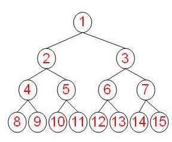

Unique Studio Lab 第一期任务，在完成之后整理一下经验。PS:第一次接触C++，花了大半天速成，部分代码可能尚存在C语言的习惯。

## 定义和存储分析

优先队列：优先队列是计算机科学中的一类抽象数据类型。优先队列中的每个元素都有各自的优先级，优先级最高的元素最先得到服务；优先级相同的元素按照其在优先队列中的顺序得到服务。在接下来的讨论中，我们用该结点储存的数据来作为该结点的优先级，数据越大，表示优先级越高。

为了方便存储，优先队列往往用堆（即一种特殊的二叉搜索树）来实现，这样实现又两个好处：

* 每一个结点下方的数据都小于该结点
* 根结点拥有最高的优先级
* 具有O(log n)时间复杂度的插入元素性能，O(n)的初始化构造的时间复杂度。

这样的存储使得我们可以方便的得到当前优先级最高的结点，实现优先队列的首要目的。

## 基本方法与存储分析

我们讲该优先队列定义为一个类`class Priority_queue`，则该类应该有如下的方法

* empty():判断队列是否为空。
* size(): 返回队列中数据的个数
* top(): 返回队列的头部数据
* push(const T&): 在队列尾部增加一个数据
* pop(): 队列头部的数据出队

我们从上到下将每个元素从1开始标号，如下图所示



观察可以发现，每个结点的子结点都是该结点的两倍和两倍加一，每个结点的父结点都是由该结点除以二取整得到。所以，如果我们用数组实现的话，就可以利用下标的二倍关系方便的得到父结点或者子结点。结合C++的特性，我们用
vector来实现该优先队列。这样就不必担心该优先队列数据上限的问题。

为了讨论的方便，优先队列的数据类型使用double，该类实现的代码如下：
```c++
class Priority_queue {
  public:
    bool empty() const; //判断队列是否为空
    size_t size() const; //返回队列中数据的个数
    const T& top() const; //返回队列的头部数据
    void push(const T& val); //在队列尾部增加一个数据
    T pop(); //队列头部的数据出队
  private:
    vector<T> PriQueue; //存储类型vector
    size_t DFS(int i) const; //对二叉树进行深度优先搜索
};

```

## 算法实现

### empty()

为了判断该优先队列是否为空，我们只需要判断该vector的第一个元素是否为0即可，因为新的元素总是会被添加到vector的最后。代码实现如下：

```c++
/* 判断队列是否为空,若为空，返回true */
bool Priority_queue::empty() const {
  double e = 1e-6; //给定一个判断是否为0的精确度
  if (PriQueue[0] > e || PriQueue[0] < -e)
    return false;
  else
    return true;
}
```

要注意的就是，由于是double类型，在判断是否为0的时候，不能使用等号。

### size()

实现size只需要对该二叉树实现一次DFS（深度优先搜索）即可，递推关系为：以该结点为根的树的结点个数 = 1 + 左子树的结点个数 + 右子树的结点个数。代码实现如下：

```c++
/* 对二叉树进行深度优先搜索 */
size_t Priority_queue::DFS(int i) const {
  double e = 1e-6; //给定一个判断是否为0的精确度
  if (PriQueue[i] > e || PriQueue[i] < -e)
    return 1 + DFS(2 * i + 1) + DFS(2 * i + 2); //递归公式
  else
    return 0;
}

/* 返回队列中数据的个数 */
size_t Priority_queue::size() const {
  return this->DFS(0);
}
```

### top()

直接返回队列的第一个结点即可，代码实现如下：

```c++
/* 返回队列的头部数据 */
const T& Priority_queue::top() const {
  return PriQueue[0];
}
```

### push(const T&)

增加数据我们采用上滤法，即我们把新的结点插入到vector的最后，之后重复如下操作：

比较该结点和其父结点数据的大小，若该结点比其父结点大，则交换这两个结点。

直至不满足上述的情况时终止。不难理解这样的操作不会破坏原二叉树的数据大小关系。代码实现如下：

```c++
/* 在队列尾部增加一个数据 */
void Priority_queue::push(const T& val) {
  int k;
  PriQueue.push_back(val);
  k = PriQueue.size() - 1; //k是新增的位置的下标
  while (PriQueue[k] > PriQueue[(k - 1) / 2])
    swap(PriQueue[k], PriQueue[(k - 1) / 2]), k = (k - 1) / 2;
}
```

在操作时要注意计算好各处下标的值，因为vector的下标和我们的标号是错开了一个的。

### pop()

获取当前队首的结点当然简单，直接返回根结点即可，但是问题在于如果删除根结点之后，剩下的结点如何移动。

类似于插入的方法，这里我们使用下滤法，即从根结点开始，重复如下操作：

比较该结点子结点的两个数据的大小，将两者中大的和该结点交换。

直至根节点变成树叶为止。接下来交换根节点和vector的最后一个数据，并删除vector尾部的数据。代码实现如下：

```c++
/* 队列头部的数据出队 */
T Priority_queue::pop() {
  int m = 0, n, k = PriQueue.size() - 1;
  double end = PriQueue[k];
  while (PriQueue[2 * m + 1] || PriQueue[2 * m + 2]) {
    n = (PriQueue[2 * m + 1] >= PriQueue[2 * m + 2])? 2 * m  + 1 : 2 * m + 2;
    swap(PriQueue[m], PriQueue[n]);
    m = n;
  }
  swap(PriQueue[m], end);
  PriQueue[k] = 0;
  return end;
}
```

要注意的是，在删除最后一个结点之前先用一个变量储存根节点的值，以便返回。

## 最终的头文件和实现

将过程中用到的自定义函数也写入，最终完成的头文件如下：

```h
/* 说明，该优先队列以数据表示优先级，数据越大，表示优先级越高 */
#include <iostream>
#include <algorithm>
#include <vector>

using T = double; //数据类型，本次任务要求使用double
using std::vector; //存储类型使用vector
using std::cout;
using std::endl; //测试用输出

class Priority_queue {
  public:
    bool empty() const; //判断队列是否为空
    size_t size() const; //返回队列中数据的个数
    const T& top() const; //返回队列的头部数据
    void push(const T& val); //在队列尾部增加一个数据
    T pop(); //队列头部的数据出队
  private:
    vector<T> PriQueue; //存储类型vector
    size_t DFS(int i) const; //对二叉树进行深度优先搜索
};

void swap(double &u, double &v); //交换两个数
```

具体实现的cpp文件如下:

```c++
#include "priority_queue.h"

/* 交换两个数 */
void swap(double &u, double &v) {
 double t;
 t = u, u = v, v = t;
}

/* 判断队列是否为空,若为空，返回true */
bool Priority_queue::empty() const {
  double e = 1e-6; //给定一个判断是否为0的精确度
  if (PriQueue[0] > e || PriQueue[0] < -e)
    return false;
  else
    return true;
}

/* 对二叉树进行深度优先搜索 */
size_t Priority_queue::DFS(int i) const {
  double e = 1e-6; //给定一个判断是否为0的精确度
  if (PriQueue[i] > e || PriQueue[i] < -e)
    return 1 + DFS(2 * i + 1) + DFS(2 * i + 2); //递归公式
  else
    return 0;
}

/* 返回队列中数据的个数 */
size_t Priority_queue::size() const {
  return this->DFS(0);
}

/* 返回队列的头部数据 */
const T& Priority_queue::top() const {
  return PriQueue[0];
}


/* 在队列尾部增加一个数据 */
void Priority_queue::push(const T& val) {
  int k;
  PriQueue.push_back(val);
  k = PriQueue.size() - 1; //k是新增的位置的下标
  while (PriQueue[k] > PriQueue[(k - 1) / 2])
    swap(PriQueue[k], PriQueue[(k - 1) / 2]), k = (k - 1) / 2;
}

/* 队列头部的数据出队 */
T Priority_queue::pop() {
  int m = 0, n, k = PriQueue.size() - 1;
  double end = PriQueue[k];
  while (PriQueue[2 * m + 1] || PriQueue[2 * m + 2]) {
    n = (PriQueue[2 * m + 1] >= PriQueue[2 * m + 2])? 2 * m  + 1 : 2 * m + 2;
    swap(PriQueue[m], PriQueue[n]);
    m = n;
  }
  swap(PriQueue[m], end);
  PriQueue[k] = 0;
  return end;
}
```